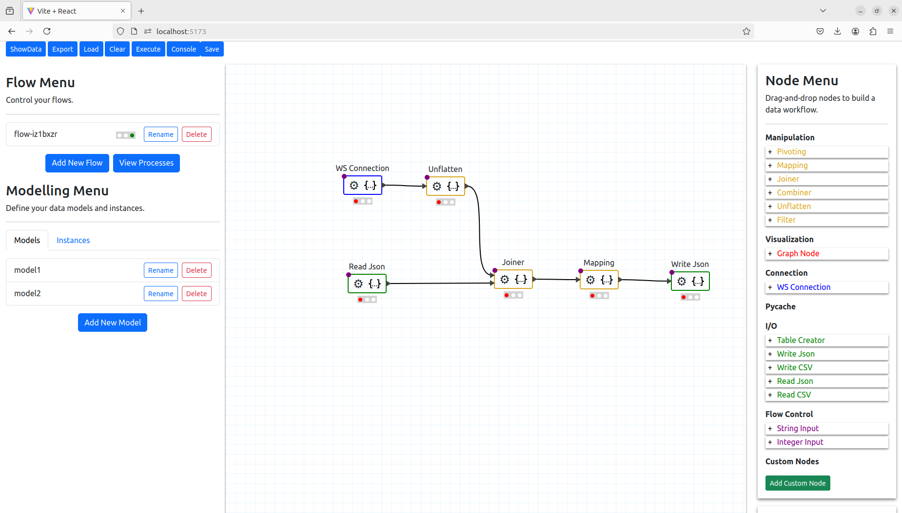

This is a research project to build data flows for Matter based IoT devices. The project builds on the work from the [Visual Programming project](https://github.com/PyWorkflowApp/visual-programming) and is based on React, React Bootstrap and [react-diagrams](https://github.com/projectstorm/react-diagrams)

# User Interface Example




# Installation

### Server (Django)

```
cd api
```

1. Install and activate python3.12 `virtual environment` 

```
/usr/bin/python3.12 -m venv ./venv
source venv/bin/activate
```

2. Install `pipenv`

- **Homebrew**
       
```
brew install pipenv
```
       
- **pip**
    
```
pip install pipenv OR pip3 install pipenv
```        
3. Install dependencies
In the `api` directory with `Pipfile` and `Pipfile.lock`.
```
pipenv install
```
4. Setup your local environment

- Create environment file with app secret 
```
echo "SECRET_KEY='TEMPORARY SECRET KEY'" > mf/.environment
```

5. Start dev server from app root
```
cd mf
pipenv run python3 manage.py migrate
pipenv run python3 manage.py runserver
```
    
If you have trouble running commands individually, you can also enter the
virtual environment created by `pipenv` by running `pipenv shell`.

### Supervisor
This project requires supervisord to control unix based processes which run the flows in the background. To install supervisor follow these steps:

1. Install supervisor

```
pip install supervisor
```

2. Start/Restart the supervisor

Cd to the `api` directory with `supervisord.conf` file
```
supervisord -c ./supervisord.conf 
```

3. Check the status of the supervisor

```
supervisorctl status
```

Note: there should be one process running that is defined the the supervisor_confs folder defined in the foo.conf file

### Web Client 
In a separate terminal window, perform the following steps to start the
front-end.

1. Install Prerequisites
```
cd web
npm install
```
2. Start dev server
```
npm run dev
```

By default, your default browser should open on the main
application page. If not, you can go to [http://localhost:5173/](http://localhost:5173/)
in your browser.
